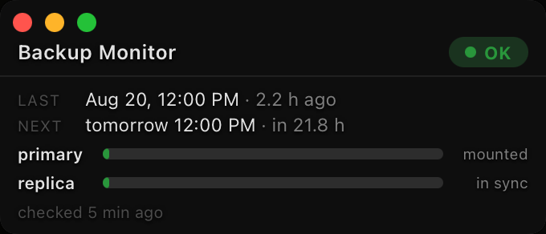
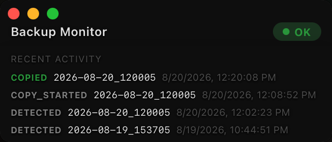

# agent-snapshot — Device-Connected Storage (DAS) System Backup Manager

Scheduled, verified, deduplicated backups of any directory to **directly-attached
drives on a machine you own** — with dual-drive redundancy, a live monitor, and a
design that assumes the thing deleting your files might be an **AI agent with
shell access**.

> **DAS, not NAS.** This system manages backup drives plugged directly into a
> computer (USB/Thunderbolt DAS). It is not a NAS product and does not speak to
> network filesystems. It is **best served on a remote system**: a separate,
> always-on machine (a Mac mini class box is ideal) holding the drive pair,
> receiving snapshots over SSH. A fully supported **single-machine mode** also
> exists — one computer backing itself up to its own attached drives and
> pushing the redundancy between them.

---

## Why this exists — the threat model

Modern development machines run AI agents, build scripts, and automation with
broad shell access. Any of them — a rogue agent, a bad `rm -rf`, a script with
a mis-expanded variable — can destroy your working tree in seconds. Sync tools
and mirrors make it worse: they faithfully replicate the deletion.

**agent-snapshot is built so that nothing running on your source machine can
permanently destroy history:**

| Threat | What happens with agent-snapshot |
|---|---|
| Rogue agent deletes your production files | Files vanish from *future* snapshots only. Every existing dated snapshot still contains them, on separate hardware, for the full retention window (default 90 days). |
| Agent/script deletes or corrupts files silently | The daily snapshot diff makes it visible; history preserves the last good copy. |
| Compromised source machine attacks the backups | The backup SSH key is **forced-command locked** (`restrict` + a closed allowlist: `snap`, `vault`, `both`, `probe`). It cannot run a delete, cannot open a shell, cannot choose what executes. Pruning runs only on the archive host, under its own policy. |
| Backup drive dies | The archive host replicates the primary DAS to a second mirror drive; a deep-verify proves the copies match. |
| Corrupt archive shipped | Vault archives are integrity-tested **before** transfer and checksum-compared **after** landing. A truncated or corrupt archive is never counted as a backup. |
| Backup silently stops running | Unreachable targets are failures, never skipped-as-success. Every run writes a summary log, and the monitor shows snapshot age and sync state at a glance. |

**Deleting something on the primary does not wipe the copy.** Snapshots are
immutable dated directories — a deletion at the source simply stops appearing
in new snapshots. The drive-to-drive replica is likewise governed by retention
policy, not blind mirroring. Details and exact semantics: [docs/SAFETY.md](docs/SAFETY.md).

---

## What you get

| Component | Runs on | What it does |
|---|---|---|
| `bin/snapshot` | source machine | rsync **hardlink snapshots** (browsable, deduplicated history) to the archive host DAS; optional compressed `tar.zst` **vault** leg with sha256 verification to a second host |
| `bin/snapshot-dispatch` | source machine | forced-command dispatcher — the SSH-key allowlist and the macOS TCC workaround |
| `bin/snapshot-install` | source machine | agent-drivable installer: config, dedicated key, launchd schedules |
| `archive-host/` | archive host | replica engine: primary DAS → mirror DAS, plus deep-verify |
| `monitor/` | archive host | small always-on window: per-drive fill bars, last-snapshot age, sync state |

## Architecture

```
 SOURCE MACHINE                          ARCHIVE HOST (remote or same machine)
 ┌──────────────────────────────┐        ┌──────────────────────────────────┐
 │ launchd (daily HH:MM)        │        │  ┌─────────────┐   ┌───────────┐ │
 │   └─ ssh localhost <mode>    │  ssh   │  │ PRIMARY DAS │──▶│ MIRROR DAS│ │
 │        └─ forced command     │───────▶│  │ dated snaps │   │  replica  │ │
 │           └─ snapshot (sshd) │ rsync  │  └─────────────┘   └───────────┘ │
 │              reads SOURCE    │        │   replicate.sh + deep-verify     │
 └──────────────────────────────┘        │   monitor (bars, ages, sync)     │
        │  optional vault leg            └──────────────────────────────────┘
        └─ tar.zst + sha256 ──────▶ second host (any OS with ssh)
```

The `ssh localhost` hop looks odd until you meet macOS TCC: launchd-spawned
processes cannot read protected folders (Desktop, Documents, removable
volumes), but sshd — granted Full Disk Access once — can. Routing scheduled
jobs through a forced-command localhost SSH key gives them the access they
need **and** pins them to an allowlist as a side effect. The full story:
[docs/DESIGN.md](docs/DESIGN.md).

## The monitor

Per-drive fill bars, last-snapshot age, last-check freshness, and sync state —
designed to show *liveness*, not just capacity, because a healthy 14 TB drive
holding 15 GB of snapshots looks dead in a percentage display. The monitor
never touches the DAS volumes: it reads only the engine's state files, so it
needs no privacy grants and cannot interfere with the drives.



The activity view is a live audit trail — each snapshot's `DETECTED →
COPY_STARTED → COPIED` progression through the replica:



## Quick start

**Have an AI agent set it up for you:** point your agent (Claude Code or
similar) at [AGENT-SETUP.md](AGENT-SETUP.md) — it is written as a
step-by-step runbook with verification gates, and every step is also
human-followable.

The short version:

```bash
git clone https://github.com/BlinkingSun/agent-snapshot.git && cd agent-snapshot
bin/snapshot-install \
  --source "$HOME/Desktop" \
  --snap-ssh user@archive-host.local \
  --snap-dir /Volumes/SnapArchive/agent-snapshot \
  --snap-time 12:00
# append the printed authorized_keys line, grant sshd Full Disk Access, then:
ssh -i ~/.ssh/id_ed25519_agent_snapshot -o IdentitiesOnly=yes localhost probe
```

## Configuration

Everything lives in `conf/snapshot.conf` — no site details in code:

| Setting | What it controls |
|---|---|
| `SOURCE` | the directory to protect (any directory) |
| `--snap-time` / `--vault-time` (installer) or the plists | **backup frequency** — daily at your chosen times; edit `StartCalendarInterval` for other cadences |
| `SNAP_RETENTION` / `VAULT_RETENTION` | days of history kept per leg |
| `SNAP_MIN_FREE_GB` | free-space floor on the DAS before abort/prune |
| `EXCLUDES` | build output & OS noise excluded from every run |

## Requirements

- **Source machine:** macOS (launchd + the TCC pattern; the scripts are plain
  bash+rsync and portable, but the packaged scheduling is macOS-first).
- **Archive host:** macOS or Linux with ssh + rsync and the DAS pair attached.
  Single-machine mode: the source machine *is* the archive host.
- **Vault host (optional):** anything reachable over ssh — POSIX or Windows
  (hashing via `sha256sum`/`shasum` or `certutil` is handled per-OS).

## More

- [AGENT-SETUP.md](AGENT-SETUP.md) — the agent-followable install runbook
- [docs/SAFETY.md](docs/SAFETY.md) — the data-protection model in depth
- [docs/DESIGN.md](docs/DESIGN.md) — why ssh-to-localhost, verification philosophy
- MIT licensed.
